# Git Version Control Lesson Plan for Students

## Session Timeline

### Part 1: The Problem

#### 1.1 Introduction & Problem Discovery

**Story Setup:** Meet Alex, a student writing a book about their school adventures.

```mermaid
flowchart LR
    A[Alex starts writing book.txt] --> B[Makes changes]
    B --> C[Wants to try new chapter]
    C --> D[Creates book_backup.txt]
    D --> E[Creates book_final.txt]
    E --> F[Creates book_final_final.txt]
    F --> G[😱 Which version is correct?]
```



**Live Demo:** Show the chaos of manual file copying

- Create `book.txt`
- Make copies with confusing names
- Try to merge changes manually (fails!)

#### 1.2 Manual Version Control Attempts

**Story:** Alex tries organizing with folders and dates


**Hands-on:** Students experience the problem

1. Create a simple text file
2. Make 3 different versions
3. Try to combine best parts from each

#### 1.3 Enter Git: The Solution

**Story:** Alex discovers Git - a time machine for files!


**Basic Git Setup:**

```bash
git init
git add book.txt
git commit -m "Started my awesome book"
```

### Part 2: Single Writer with Git

#### 2.1 Git Basics - Time Travel for Your Book

**Concepts:** init, add, commit

```mermaid
flowchart LR
    A[Working Directory<br/>📝 Current edits] -->|git add| B[Staging Area<br/>📋 Ready to save]
    B -->|git commit| C[Repository<br/>💾 Saved forever]
```



**Hands-on Exercise:**

```bash
# Initialize Alex's book project
git init my-book
cd my-book
echo "Chapter 1: The Beginning" > book.txt
git add book.txt
git commit -m "Started Chapter 1"

# Make changes
echo "It was a dark and stormy night..." >> book.txt
git add book.txt
git commit -m "Added opening line"

# View history
git log --oneline
```

#### 2.2 Branches - Parallel Universes for Your Story

**Story:** Alex wants to try two different endings without losing either


**Hands-on:**

```bash
# Create alternate storyline
git branch alternate-plot
git checkout alternate-plot
echo "Chapter 3: The Plot Twist" >> book.txt
git add book.txt
git commit -m "Added plot twist"

# Switch back to main story
git checkout main
echo "Chapter 3: The Journey Continues" >> book.txt
git add book.txt
git commit -m "Added regular chapter 3"
```

#### 2.3 Time Travel - Undoing Mistakes

**Story:** Oh no! Alex accidentally deleted an entire chapter and wants to go back to yesterday's version.

```mermaid
gitGraph
    commit id: "Chapter 1 ✅"
    commit id: "Chapter 2 ✅"
    commit id: "Chapter 3 ✅"
    commit id: "Oops! Deleted everything 😱"
    commit id: "Back to Chapter 3 ✅" type: REVERSE
```



**Three Ways to Time Travel:**

1. **Soft Reset** - "I want to undo my last commit but keep my changes"

   ```bash
   git reset --soft HEAD~1
   # Like erasing with pencil - content stays, just the "save" is undone

   # To Go bak to the header
   git reset --hard
   # this takes you back to the latest commit/draft
   ```

2. **Hard Reset** - "Take me back completely to yesterday"

   ```bash
   git reset --hard HEAD~1
   # Like using a time machine - everything goes back exactly
   ```

3. **Revert** - "Add a new commit that undoes the bad one"
   ```bash
   git revert HEAD
   # Like writing "Nevermind, ignore that last change" in your diary
   ```

**Hands-on Exercise:**

```bash
# Alex makes a mistake
echo "This chapter is terrible" > book.txt
git add book.txt
git commit -m "Ruined the book"

# Time travel back!
git log --oneline  # See the history
git reset --hard HEAD~1  # Go back one commit
cat book.txt  # The good version is back!
```

**Video Game Save File Analogy:**

```mermaid
flowchart LR
    A[Save 1: Beat Level 1] --> B[Save 2: Beat Level 2]
    B --> C[Save 3: Died on Boss 😵]
    C --> D[Load Save 2 🎮]
    D --> E[Try Boss Again!]
```



#### 2.4 Collaboration Begins

**Story:** Alex's friend Bailey wants to help edit

```mermaid
flowchart TB
    A[Alex's Computer<br/>Original] -->|push| B[GitHub/Cloud<br/>📤 Shared Space]
    B -->|pull| C[Bailey's Computer<br/>Copy to edit]
    C -->|push| B
    B -->|pull| A
```



---

### Part 3: Advanced Collaboration

#### 3.1 Merge vs Rebase - Two Ways to Combine Work

**Merge - Preserving History:**


**Rebase - Clean Timeline:**


**Simple Explanation:**

- **Merge:** "Let's combine our work and show we worked separately"
- **Rebase:** "Let's make it look like we worked one after another"

**Hands-on Demo:**

```bash
# Merge example
git checkout -b edit-chapter-1
echo "Fixed spelling errors" >> edits.txt
git add edits.txt
git commit -m "Bailey's edits"
git checkout main
git merge edit-chapter-1

# Rebase example (new branch)
git checkout -b grammar-fixes
echo "Fixed grammar" >> grammar.txt
git add grammar.txt
git commit -m "Grammar improvements"
git checkout main
git rebase grammar-fixes
```

#### 3.2 Case Studies

**GitHub Workflow (from images):**

- Multiple branches for features
- Pull requests for review
- Continuous integration

**Apache Subversion (SVN):**

- Centralized model
- Trunk/branches/tags structure
- Different philosophy but same goal

### Part 4: Alternative Analogies & Practice

#### 4.1 Five Additional Analogies

**1. Video Game Save Files**


**2. Recipe Development**


**3. Music Production**


**4. Art Project Versions**


**5. Science Experiment Log**


---

## Complete Git Workflow for Book Writers

```mermaid
flowchart TB
    subgraph "Problem Phase"
        A1[Write book.txt] --> A2[Copy to book_backup.txt]
        A2 --> A3[Copy to book_final.txt]
        A3 --> A4[🤯 Lost track of versions]
    end

    subgraph "Git Solution Phase"
        B1[git init] --> B2[git add book.txt]
        B2 --> B3[git commit -m 'Chapter 1']
        B3 --> B4[git branch new-ending]
        B4 --> B5[Make changes]
        B5 --> B6[git merge new-ending]
    end

    subgraph "Collaboration Phase"
        C1[git remote add origin] --> C2[git push]
        C2 --> C3[Friend: git clone]
        C3 --> C4[Friend: git push]
        C4 --> C5[You: git pull]
    end

    A4 --> B1
    B6 --> C1
```



---

## Git Workflow Example


### Step-by-Step Explanation

#### 1. Main Branches

- **`main`**: Production-ready code. Every commit here is a release.
- **`develop`**: Integration branch for features before release.

#### 2. Start Feature Development

- Create a **feature branch** from `develop`:
  ```bash
  git checkout -b feature/my-feature develop
  ```
- Develop the feature, commit your changes.
- Once done, merge back to `develop`:
  ```bash
  git checkout develop
  git merge feature/my-feature
  ```

#### 3. Prepare a Release

- When `develop` is stable and you're ready to release:
  ```bash
  git checkout -b release/v1.0.0 develop
  ```
- Final fixes, changelog, version bump are done here.
- Then merge into both `main` and `develop`:

  ```bash
  git checkout main
  git merge release/v1.0.0
  git tag v1.0.0

  git checkout develop
  git merge release/v1.0.0
  ```

#### 4. Hotfix (if production bug found)

- Create a **hotfix branch** from `main`:
  ```bash
  git checkout -b hotfix/v1.0.1 main
  ```
- Apply fixes and commit.
- Merge into both `main` and `develop`:

  ```bash
  git checkout main
  git merge hotfix/v1.0.1
  git tag v1.0.1

  git checkout develop
  git merge hotfix/v1.0.1
  ```

### Branch Summary Table

| Branch Type | Purpose                            | Created From | Merged Into       |
| ----------- | ---------------------------------- | ------------ | ----------------- |
| `feature/*` | New feature development            | `develop`    | `develop`         |
| `release/*` | Prepare for production release     | `develop`    | `main`, `develop` |
| `hotfix/*`  | Urgent fixes for production issues | `main`       | `main`, `develop` |

---

## Security Considerations (Reference to uploaded content)

- Version control helps with security by tracking all changes
- Can identify when and who made specific changes
- Rollback capabilities if something goes wrong
- Code review process (as mentioned in the security controls section)

---

## Visual Learning Tools

### Recommended Interactive Git Tools:

1. **Learn Git Branching** (learngitbranching.js.org)

   - Visual, game-like interface
   - Progressive challenges

2. **Visualizing Git** (git-school.github.io/visualizing-git/)

   - Real-time visualization of git commands

3. **GitHub Desktop**

   - GUI for beginners
   - Visual diff viewer

4. **Git Kraken**

   - Beautiful branch visualization
   - Drag-and-drop operations

5. **Oh My Git!** (ohmygit.org)
   - Game that teaches Git concepts

---

## Quick Reference Commands

### Essential Git Commands for Students:

```bash
git init                  # Start tracking
git add <file>           # Stage changes
git commit -m "message"  # Save snapshot
git status              # What's changed?
git log                 # View history
git branch <name>       # Create universe
git checkout <branch>   # Switch universe
git merge <branch>      # Combine work
git pull                # Get updates
git push                # Share work

# Time Travel Commands
git reset --soft HEAD~1  # Undo last commit, keep changes
git reset --hard HEAD~1  # Go back completely
git revert HEAD          # Create new commit that undoes last one
git log --oneline        # See history to pick where to go
```

---

## Assessment Activity (If time permits)

**Challenge:** Create a collaborative story

1. Groups of 3 students
2. Each creates a branch
3. Each adds one paragraph
4. Merge all branches
5. Resolve any conflicts together

---

## Key Takeaways

1. Version control = Time machine for files
2. Git prevents the "final_final_v2_REAL.txt" problem
3. Branches = Parallel universes for trying ideas
4. Collaboration without stepping on toes
5. Every change is tracked and reversible

---

## Homework

- Install Git on personal computer
- Try "Learn Git Branching" tutorial (first 5 levels)
- Create a git repository for a school project
- Optional: Create a GitHub account and explore

---

## Teacher Notes

- Emphasize hands-on practice
- Use simple, relatable examples
- Encourage questions during breaks
- Have students work in pairs for exercises
- Keep terminal commands visible and typed slowly
- Prepare USB drives with Git installers for students without internet
